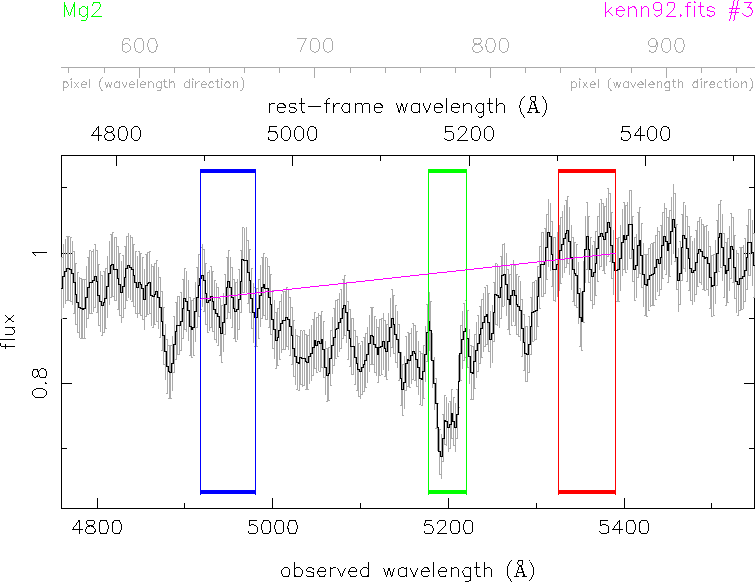

.. indexf documentation master file, created by
   sphinx-quickstart on Mon Jan  2 13:33:46 2017.
   You can adapt this file completely to your liking, but it should at least
   contain the root `toctree` directive.

Welcome to indexf's documentation!
==================================

**indexf** is a program written in C++ to measure line-strength indices in
fully calibrated FITS spectra.

.. toctree::
   :maxdepth: 2

   description
   license
   installation
   using
   examples
   zreferences
   

